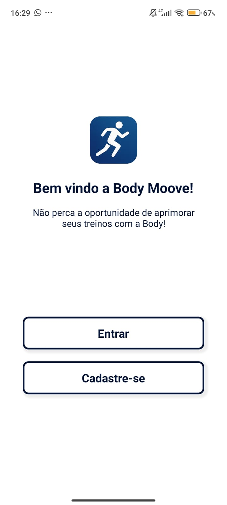
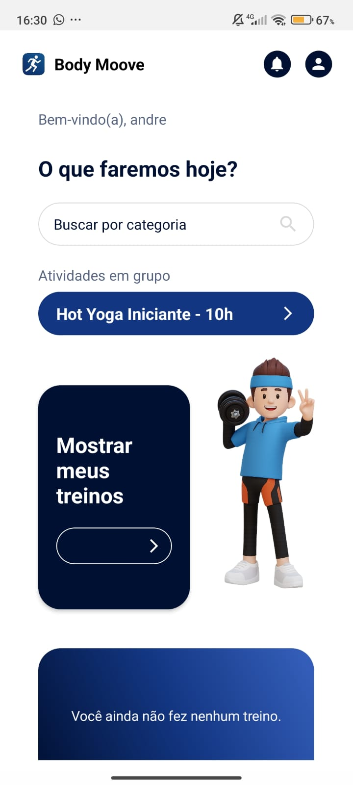
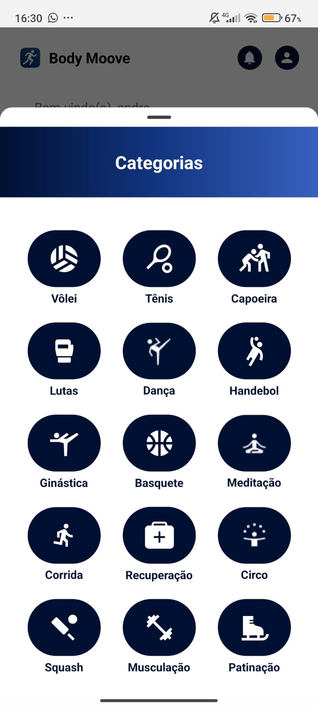
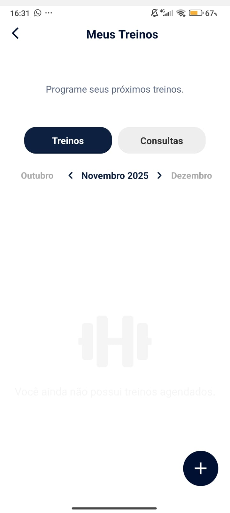
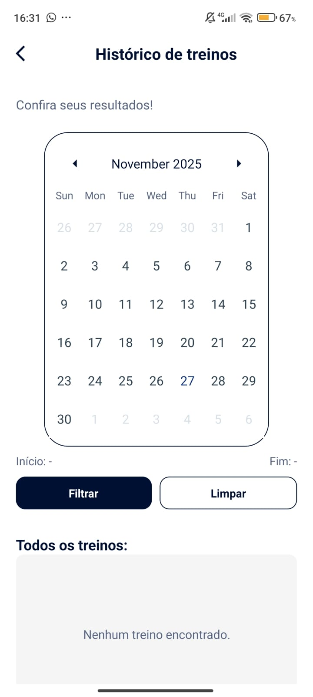
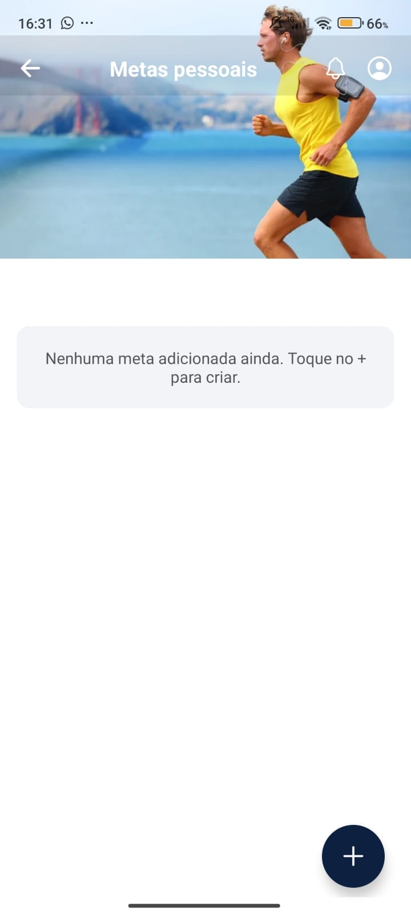
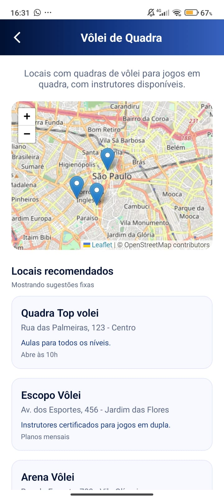
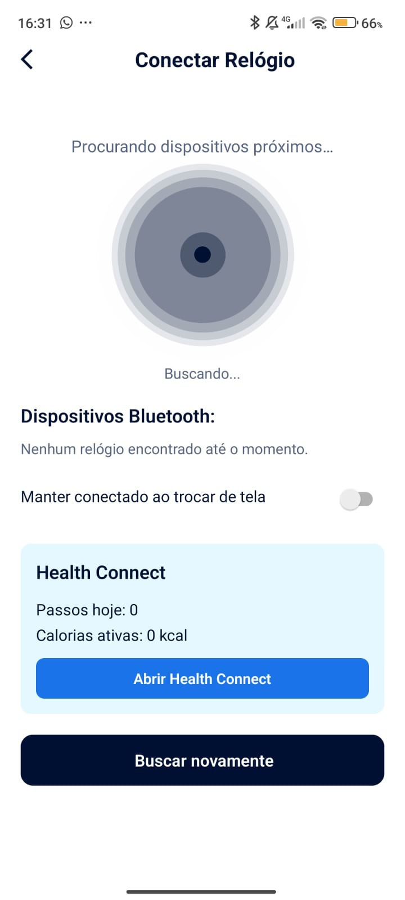

# BodyMoove — Plataforma Mobile para Gestão de Atividades Físicas

## Trabalho de Conclusão de Curso (TCC)

### Autores
- André Doria Santos  
- Beatriz Salino  
- Darlene Passos  
- Kaique Guilherme  
- Marília de Mattos
- Renan Mendes 
- Sophia Regina  

### Curso
Desenvolvimento de Sistemas

### Instituição
Faculdade SENAI "Naldir Dias de Figueiredo" - 119

### Orientador
- Thier Alarcon
- Lucas Gonzalez
- Vitor Lima

---

## 1. Introdução
O projeto **BodyMoove** consiste no desenvolvimento de um aplicativo mobile voltado à organização,
planejamento e acompanhamento de atividades físicas. O sistema foi desenvolvido utilizando
**React Native com Expo** e tem como objetivo principal incentivar hábitos saudáveis por meio da
tecnologia.

O aplicativo permite que usuários organizem seus treinos, acompanhem metas e encontrem locais
adequados para a prática esportiva, tudo em uma única plataforma de forma intuitiva e funcional.

---

## 2. Objetivo Geral
Desenvolver um aplicativo mobile que facilite a gestão de atividades físicas, promovendo organização
e motivação para a prática esportiva.

---

## 3. Objetivos Específicos
- Implementar agendamento de treinos
- Desenvolver uma agenda visual por calendário
- Criar histórico de atividades
- Permitir definição de metas pessoais
- Implementar busca por categorias esportivas
- Exibir locais para prática esportiva em mapa
- Integrar dispositivos wearable
- Aplicar boas práticas de usabilidade

---

## 4. Escopo do Projeto

### Funcionalidades implementadas:

### 4.1 Autenticação
Tela de entrada, login e cadastro.

### 4.2 Tela Inicial
Painel principal com sugestões de treinos, acesso às funções principais e busca por categoria.

### 4.3 Gerenciamento de Treinos
Criação de treinos por data e horário, visualização mensal e organização por abas.

### 4.4 Histórico de Treinos
Filtro por data e listagem organizada dos treinos realizados.

### 4.5 Metas Pessoais
Área dedicada à criação e acompanhamento de objetivos futuros.

### 4.6 Categorias de Atividades
Modalidades como:
Vôlei, Musculação, Dança, Corrida, Meditação, Basquete, Capoeira, Lutas, Handebol, etc.

### 4.7 Subcategorias Esportivas
Exemplo:
- Vôlei de quadra
- Vôlei de praia
- Futevôlei

### 4.8 Mapa de Locais
Exibição de locais com mapa interativo e sugestões fixas.

### 4.9 Integração com Dispositivos
Conexão com smartwatch via Bluetooth e Health Connect para leitura de passos e calorias.

---

## 5. Tecnologias Utilizadas
- React Native
- Expo
- TypeScript
- JavaScript
- Node.js
- Health Connect
- Bluetooth API
- Leaflet
- OpenStreetMap
- Git e GitHub

---

## 6. Metodologia
O desenvolvimento seguiu conceitos de:
- Programação modular
- Reutilização de código
- Componentização
- Controle de versão (Git)
- Desenvolvimento incremental

---

## 7. Resultados Obtidos
- Aplicação funcional
- Interface validada
- Sistema de categorias completo
- Calendário funcional
- Integração simulada com dispositivos
- Mapa interativo implementado

---

## Capturas de Tela do Aplicativo

### Tela de Login

### Tela Inicial

### Categorias de Atividades

### Agenda / Meus Treinos

### Histórico

### Metas

### Mapa de Locais

### Integração com Smartwatch

## 8. Trabalhos Futuros
- Histórico em nuvem
- API para coleta de dados simultâneos
- Gráficos de desempenho
- IA para recomendações personalizadas
- Utilização da tecnologia SMTP para confirmação de Treinos por e-mail

---

## 9. Conclusão
O projeto BodyMoove satisfez os objetivos propostos, entregando uma plataforma funcional e escalável
voltada à organização de atividades físicas. A arquitetura permite evolução futura e integração com
novos serviços.

---

## 10. Licença
Projeto acadêmico sem fins comerciais.

